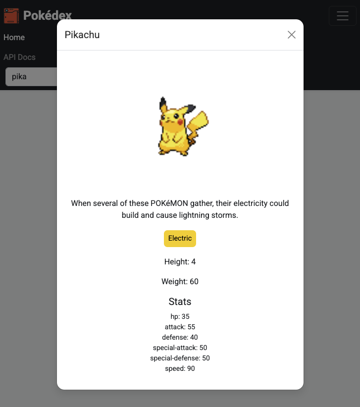
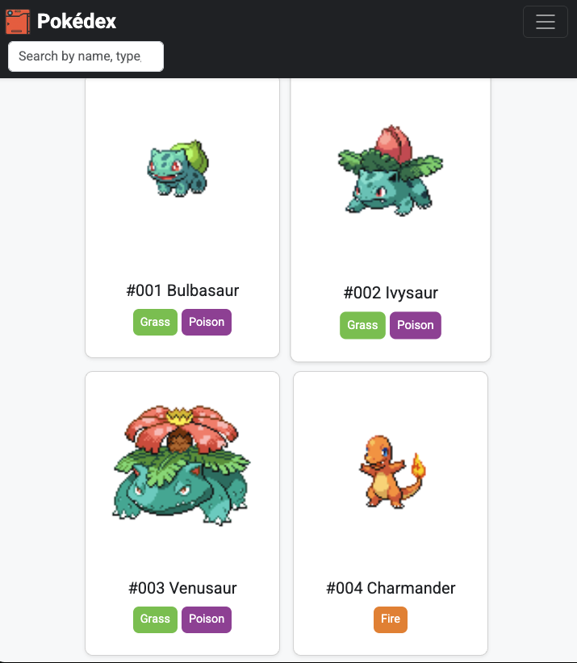

# Pokédex App

A simple Pokédex web application that displays a list of the first 151 Pokémon using data from the PokéAPI. Users can click on a Pokémon to see more details in a modal window and use the search bar to filter by name, number, or type. The app is styled using Bootstrap and follows clean JavaScript practices.

## Live Demo

[View the Live App on GitHub Pages](https://github.com/Royjysmael/Pokedex-v1//)

---

## Technologies Used

- HTML5
- CSS3
- JavaScript (ES6+)
- Bootstrap 5
- Fetch API
- ESLint & Prettier

---

## Features

- Fetches and displays the first 151 Pokémon from the PokéAPI
- Modal with Pokémon details (height, weight, types, stats, and description)
- Live search bar (filter by name, number, or type)
- Responsive card layout using Bootstrap
- Loading indicator while fetching data
- Linted and formatted JavaScript with ESLint and Prettier
- Minified CSS and JS in `/dist`

---

## Screenshot

  
_Modal showing Pokémon details_

_Main UI with Pokémon cards_

## Project Reflection

### What was your role for this project and what tasks did you face?

I built the app from scratch using vanilla JavaScript. I had to structure the project using functions and an IIFE pattern, fetch external API data, manage DOM updates, and add features like a modal and search functionality.

### What decisions did you take and why?

I chose to keep everything inside an IIFE to avoid polluting the global scope. I also decided to use Bootstrap for quicker and cleaner styling. The live search helps improve usability, and I added loading messages to give users feedback while waiting.

### What I'd do differently:

- Try breaking up the code into smaller files using modules (once I learn how)
- Add a way to load Pokémon in smaller groups or pages to improve performance
- Include a smoother loading animation

### What lessons did you learn during this project?

- How to fetch and handle API data in JavaScript
- How to structure and organize JavaScript code better
- How to debug effectively using `console.log()` and browser tools
- The value of clean code and formatting tools like ESLint and Prettier
